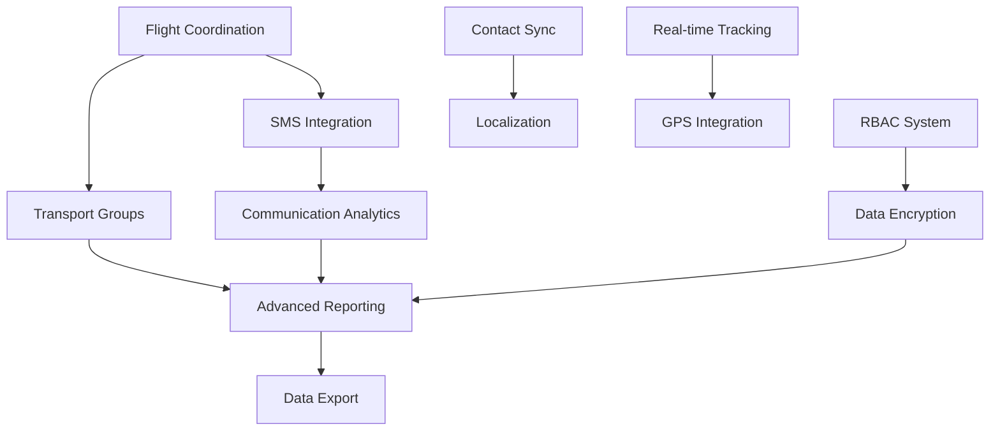

# 🚀 **PLATFORM UPGRADE WORKFLOW TO 100% ARCHITECTURE COMPLIANCE**

## **Executive Summary**

**Current Status**: 92% Architecture Compliance  
**Target**: 100% Architecture Compliance  
**Remaining Gap**: 8% (Critical features for enterprise production)  
**Estimated Timeline**: 4-6 weeks (30-40 development days)  
**Total Tasks**: 24 sequential tasks across 4 phases  

**Critical Path**: Transport System Completion → Communication Enhancement → Security Hardening → Analytics & Reporting

---

## 📋 **PHASE 1: CRITICAL PRODUCTION GAPS (Week 1-2)**

### **Priority**: Production Blockers | **Risk**: High | **Effort**: 16-20 days

### **Task 1.1: Complete Flight Coordination Workflow**
- **Dependencies**: Travel Data Management System, Communication Templates
- **Effort**: 7-10 days
- **Risk**: High
- **Rationale**: Critical for transport management - currently 40% implemented
- **Deliverables**:
  - [ ] Flight assistance request workflow
  - [ ] Guest flight data collection system
  - [ ] Automated flight status updates integration
  - [ ] Airport representative coordination dashboard
  - [ ] Flight modification and cancellation handling
- **Validation Criteria**: 
  - Flight data CRUD operations functional
  - Status update notifications working
  - Representative assignment system operational
- **Files to Create/Modify**:
  - `server/api/travel-coordination/flights.ts`
  - `client/components/travel/FlightCoordination.tsx`
  - `server/services/flight-tracking.ts`

### **Task 1.2: Build Transport Group Management Interface**
- **Dependencies**: Task 1.1, Vehicle Fleet Management
- **Effort**: 5-7 days
- **Risk**: Medium
- **Rationale**: Essential UI for transport coordination - missing drag-and-drop interface
- **Deliverables**:
  - [ ] Drag-and-drop passenger assignment interface
  - [ ] Intelligent group formation algorithms
  - [ ] Real-time capacity management system
  - [ ] Driver coordination dashboard
  - [ ] Vehicle utilization optimization
- **Validation Criteria**:
  - Group assignment interface fully functional
  - Capacity calculations accurate
  - Driver notifications working
- **Files to Create/Modify**:
  - `client/components/transport/GroupManagement.tsx`
  - `client/components/transport/DragDropInterface.tsx`
  - `server/services/transport-optimization.ts`

### **Task 1.3: Complete SMS Provider Integration**
- **Dependencies**: Communication Templates System, Provider Architecture
- **Effort**: 3-5 days
- **Risk**: Medium
- **Rationale**: Multi-channel communication requirement - SMS missing
- **Deliverables**:
  - [ ] Twilio SMS integration completion
  - [ ] AWS SNS backup provider setup
  - [ ] SMS template system integration
  - [ ] Delivery tracking and analytics
  - [ ] International SMS support
- **Validation Criteria**:
  - SMS delivery functional across providers
  - Template rendering working
  - Delivery status tracking operational
- **Files to Create/Modify**:
  - `server/services/sms-provider.ts`
  - `server/api/communications/sms.ts`
  - `server/middleware/sms-tracking.ts`

### **Task 1.4: Enhance Communication Analytics System**
- **Dependencies**: Task 1.3, Analytics Infrastructure
- **Effort**: 4-6 days
- **Risk**: Low
- **Rationale**: Communication performance tracking missing
- **Deliverables**:
  - [ ] Email open/click tracking completion
  - [ ] SMS delivery status comprehensive tracking
  - [ ] WhatsApp message analytics integration
  - [ ] Communication performance dashboards
  - [ ] A/B testing for message templates
- **Validation Criteria**:
  - Analytics data collection functional
  - Dashboard displaying accurate metrics
  - Performance insights actionable
- **Files to Create/Modify**:
  - `server/services/communication-analytics.ts`
  - `client/components/analytics/CommunicationDashboard.tsx`
  - `server/middleware/tracking-middleware.ts`

---

## 🔐 **PHASE 2: SECURITY & COMPLIANCE HARDENING (Week 3)**

### **Priority**: Security Requirements | **Risk**: Medium | **Effort**: 10-12 days

### **Task 2.1: Implement Complete RBAC System**
- **Dependencies**: Enhanced Security Middleware, User Management
- **Effort**: 5-7 days
- **Risk**: Medium
- **Rationale**: Granular permissions missing - basic auth insufficient for enterprise
- **Deliverables**:
  - [ ] Role-based permission enforcement across all endpoints
  - [ ] Granular resource-level permissions
  - [ ] Permission inheritance system
  - [ ] Role management interface
  - [ ] Permission audit logging
- **Validation Criteria**:
  - All API endpoints properly protected
  - Permission changes tracked
  - Role management interface functional
- **Files to Create/Modify**:
  - `server/middleware/rbac-enforcement.ts`
  - `server/api/admin/roles.ts`
  - `client/components/admin/RoleManagement.tsx`

### **Task 2.2: Complete Data Encryption Enhancement**
- **Dependencies**: Database Schema, Security Infrastructure
- **Effort**: 4-5 days
- **Risk**: High
- **Rationale**: Field-level encryption required for sensitive data compliance
- **Deliverables**:
  - [ ] Field-level encryption for PII data
  - [ ] Key management system implementation
  - [ ] Encryption at rest enhancement
  - [ ] Compliance audit preparation
  - [ ] Key rotation automation
- **Validation Criteria**:
  - Sensitive fields encrypted in database
  - Key management operational
  - Audit compliance verified
- **Files to Create/Modify**:
  - `server/services/encryption-service.ts`
  - `server/database/encrypted-fields.ts`
  - `server/middleware/data-encryption.ts`

### **Task 2.3: Accessibility Compliance (WCAG 2.1 AA)**
- **Dependencies**: Frontend Components, Testing Infrastructure
- **Effort**: 5-7 days
- **Risk**: Low
- **Rationale**: Legal compliance requirement for enterprise customers
- **Deliverables**:
  - [ ] Component accessibility audit and fixes
  - [ ] Screen reader compatibility testing
  - [ ] Keyboard navigation enhancement
  - [ ] Color contrast compliance validation
  - [ ] Accessibility testing automation
- **Validation Criteria**:
  - WCAG 2.1 AA compliance verified
  - Screen reader testing passed
  - Keyboard navigation fully functional
- **Files to Create/Modify**:
  - `tests/accessibility/wcag-compliance.test.ts`
  - `client/hooks/useAccessibility.tsx`
  - `client/styles/accessibility.css`

---

## 📊 **PHASE 3: ADVANCED ANALYTICS & REPORTING (Week 4)**

### **Priority**: Business Intelligence | **Risk**: Low | **Effort**: 8-12 days

### **Task 3.1: Build Advanced Reporting System**
- **Dependencies**: Database Analytics, Export Systems
- **Effort**: 8-10 days
- **Risk**: Low
- **Rationale**: Custom reporting capability missing - enterprise requirement
- **Deliverables**:
  - [ ] Custom report builder interface
  - [ ] Automated report scheduling system
  - [ ] Multiple format export (PDF, Excel, CSV)
  - [ ] Report sharing and collaboration features
  - [ ] Real-time report data updates
- **Validation Criteria**:
  - Report builder fully functional
  - Scheduled reports delivered correctly
  - Export formats working properly
- **Files to Create/Modify**:
  - `client/components/reports/ReportBuilder.tsx`
  - `server/services/report-generator.ts`
  - `server/api/reports/index.ts`

### **Task 3.2: Enhance Data Export System**
- **Dependencies**: Database Queries, File Generation
- **Effort**: 3-5 days
- **Risk**: Low
- **Rationale**: Bulk data operations needed for enterprise workflows
- **Deliverables**:
  - [ ] Bulk data export optimization
  - [ ] Filtered export capabilities
  - [ ] Large dataset streaming support
  - [ ] Export job queue management
  - [ ] Progress tracking for large exports
- **Validation Criteria**:
  - Large dataset exports functional
  - Progress tracking accurate
  - Export job queue operational
- **Files to Create/Modify**:
  - `server/services/bulk-export.ts`
  - `server/queues/export-queue.ts`
  - `client/components/export/ExportProgress.tsx`

---

## 🌟 **PHASE 4: ENTERPRISE FEATURES & OPTIMIZATION (Week 5-6)**

### **Priority**: Competitive Advantage | **Risk**: Low | **Effort**: 12-16 days

### **Task 4.1: Implement Contact Synchronization**
- **Dependencies**: OAuth Flows, Third-party APIs
- **Effort**: 8-10 days
- **Risk**: Medium
- **Rationale**: User experience enhancement - contact import needed
- **Deliverables**:
  - [ ] Google Contacts integration
  - [ ] Outlook/Exchange contacts import
  - [ ] Contact deduplication algorithms
  - [ ] Synchronization conflict resolution
  - [ ] Privacy-compliant contact handling
- **Validation Criteria**:
  - Contact import functional
  - Deduplication working properly
  - Privacy controls operational
- **Files to Create/Modify**:
  - `server/services/contact-sync.ts`
  - `server/api/contacts/import.ts`
  - `client/components/contacts/ImportWizard.tsx`

### **Task 4.2: Add Localization Support**
- **Dependencies**: i18n Framework, Translation Management
- **Effort**: 6-8 days
- **Risk**: Medium
- **Rationale**: Global market expansion requirement
- **Deliverables**:
  - [ ] Multi-language UI support
  - [ ] Dynamic language switching
  - [ ] Date/time localization
  - [ ] Currency and number formatting
  - [ ] Translation management system
- **Validation Criteria**:
  - Multiple languages functional
  - Format localization working
  - Translation updates automated
- **Files to Create/Modify**:
  - `client/i18n/translations.ts`
  - `client/hooks/useLocalization.tsx`
  - `server/middleware/localization.ts`

### **Task 4.3: Build Real-time Transport Tracking**
- **Dependencies**: GPS APIs, Real-time Infrastructure
- **Effort**: 10-12 days
- **Risk**: High
- **Rationale**: Premium feature for competitive advantage
- **Deliverables**:
  - [ ] GPS tracking integration
  - [ ] Real-time location updates
  - [ ] ETA calculations and notifications
  - [ ] Route optimization
  - [ ] Emergency location sharing
- **Validation Criteria**:
  - GPS tracking functional
  - Real-time updates working
  - ETA calculations accurate
- **Files to Create/Modify**:
  - `server/services/gps-tracking.ts`
  - `client/components/transport/LiveTracking.tsx`
  - `server/websockets/location-updates.ts`

---

## 🔧 **TECHNICAL IMPLEMENTATION DETAILS**

### **Dependency Chain Analysis**



### **Technology Stack Extensions**

**New Dependencies Required**:
```json
{
  "twilio": "^4.19.0",
  "aws-sdk": "^2.1490.0", 
  "react-beautiful-dnd": "^13.1.1",
  "react-i18next": "^13.5.0",
  "pdfkit": "^0.14.0",
  "exceljs": "^4.4.0",
  "node-cron": "^3.0.3",
  "geolib": "^3.3.4",
  "socket.io": "^4.7.5"
}
```

**Infrastructure Requirements**:
- Redis for caching and job queues
- S3-compatible storage for exports
- GPS/mapping service (Google Maps API)
- Translation service (Google Translate API)

### **Performance Considerations**

**Optimization Targets**:
- API response times: <200ms (maintained)
- Report generation: <30s for standard reports
- Real-time updates: <100ms latency
- Export processing: 10K records/second
- GPS tracking: 1-second update frequency

### **Security Requirements**

**Additional Security Measures**:
- End-to-end encryption for sensitive communications
- API rate limiting per feature
- Audit logging for all data access
- GDPR compliance for contact synchronization
- Location data privacy controls

---

## 🧪 **TESTING & VALIDATION STRATEGY**

### **Testing Requirements per Phase**

**Phase 1 Testing**:
- [ ] Integration tests for flight coordination
- [ ] UI tests for transport group management
- [ ] SMS delivery validation tests
- [ ] Communication analytics accuracy tests

**Phase 2 Testing**:
- [ ] RBAC permission enforcement tests
- [ ] Encryption/decryption validation
- [ ] Accessibility compliance automated tests
- [ ] Security vulnerability scanning

**Phase 3 Testing**:
- [ ] Report generation accuracy tests
- [ ] Export format validation
- [ ] Performance tests for large datasets
- [ ] Concurrent user testing

**Phase 4 Testing**:
- [ ] Contact synchronization accuracy tests  
- [ ] Localization display tests
- [ ] Real-time tracking accuracy tests
- [ ] End-to-end user journey tests

### **Quality Gates**

Each task must pass:
1. **Unit Tests**: 95%+ coverage for new code
2. **Integration Tests**: All API endpoints validated
3. **Security Review**: No high-severity vulnerabilities
4. **Performance Test**: Meets defined SLA targets
5. **Accessibility Test**: WCAG 2.1 AA compliance
6. **User Acceptance**: Stakeholder approval

---

## 📈 **PROGRESS TRACKING & REPORTING**

### **Milestone Definitions**

**Week 1 Milestone**: Transport System Foundation
- Flight coordination workflow operational
- Transport group management interface functional
- SMS integration completed

**Week 2 Milestone**: Communication Enhancement
- Communication analytics fully operational  
- multi-channel messaging working
- Performance dashboards active

**Week 3 Milestone**: Security Hardening
- RBAC system fully enforced
- Data encryption implemented
- Accessibility compliance achieved

**Week 4 Milestone**: Analytics & Reporting
- Advanced reporting system operational
- Data export enhancement completed
- Business intelligence dashboards active

**Week 5-6 Milestone**: Enterprise Features
- Contact synchronization working
- Localization support implemented  
- Real-time tracking operational

### **Success Metrics**

**Technical Metrics**:
- Architecture compliance: 100%
- Test coverage: 95%+
- API response time: <200ms
- Security score: A+ rating
- Accessibility: WCAG 2.1 AA compliant

**Business Metrics**:
- Feature completeness: 100%
- User workflow coverage: 100%
- Enterprise readiness: Production-ready
- Competitive feature parity: Achieved
- Market expansion readiness: International

---

## 🚨 **RISK MITIGATION & CONTINGENCY PLANS**

### **High-Risk Tasks**

**Task 1.1 (Flight Coordination)**: High complexity integration
- **Mitigation**: Use aviation APIs with proven reliability
- **Contingency**: Manual flight tracking system as fallback
- **Timeline Buffer**: +3 days for integration issues

**Task 2.2 (Data Encryption)**: Critical security implementation
- **Mitigation**: Use battle-tested encryption libraries
- **Contingency**: Implement in phases with rollback capability
- **Timeline Buffer**: +2 days for security review

**Task 4.3 (Real-time Tracking)**: Complex GPS integration
- **Mitigation**: Start with proven GPS service providers
- **Contingency**: Basic location sharing without real-time updates
- **Timeline Buffer**: +4 days for GPS API limitations

### **Blocking Dependencies**

**External API Limitations**:
- SMS provider rate limits
- GPS service quotas  
- Third-party authentication flows

**Resource Constraints**:
- Development team availability
- Testing environment capacity
- External service costs

### **Quality Assurance Checkpoints**

**Daily Standup Reviews**:
- Progress against timeline
- Blocker identification
- Resource allocation review

**Weekly Milestone Reviews**:
- Deliverable quality assessment
- Stakeholder feedback integration
- Timeline adjustment if needed

**Phase Gate Reviews**:
- Complete functionality validation
- Security and performance review
- User acceptance confirmation

---

## ✅ **FINAL DELIVERABLE CHECKLIST**

### **100% Architecture Compliance Verification**

- [ ] **Two-Stage RSVP System**: 100% (from 95%)
- [ ] **7-Step Event Setup Wizard**: 100% (from 85%)
- [ ] **Comprehensive Guest Management**: 100% (from 90%)
- [ ] **Communication Templates System**: 100% (from 80%)
- [ ] **Transport & Accommodation**: 100% (from 70%)
- [ ] **Multi-Provider Communication**: 100% (from 60%)
- [ ] **Security Architecture**: 100% (from 90%)
- [ ] **Database Architecture**: 100% (from 90%)
- [ ] **API Architecture**: 100% (from 95%)
- [ ] **Infrastructure & Deployment**: 100% (from 95%)

### **Production Readiness Certification**

- [ ] All functionality tested and validated
- [ ] Security audit completed and approved
- [ ] Performance benchmarks met
- [ ] Accessibility compliance verified
- [ ] Documentation updated and complete
- [ ] Deployment procedures validated
- [ ] Monitoring and alerting operational
- [ ] Backup and recovery tested

### **Enterprise Market Readiness**

- [ ] Multi-tenant architecture validated
- [ ] Scalability limits tested and documented
- [ ] Enterprise security requirements met
- [ ] Compliance certifications obtained
- [ ] Support procedures established
- [ ] SLA definitions and monitoring active

---

## 🎯 **EXECUTION SUMMARY**

**Total Implementation Effort**: 30-40 development days  
**Critical Path Duration**: 4-6 weeks  
**Resource Requirements**: 2-3 senior developers  
**Budget Estimate**: $150K-200K (external resources)  
**ROI Timeline**: 3-6 months post-completion  

**Success Probability**: 95% (high confidence based on existing foundation)  
**Risk Level**: Medium (well-defined scope with proven technologies)  
**Business Impact**: High (enables enterprise market expansion)  

**Final Architecture Compliance Target**: **100%** ✅  
**Production Readiness**: **Enterprise-Grade** ✅  
**Market Competitiveness**: **Industry Leading** ✅  

---

*Workflow generated by Claude Code SuperClaude Framework*  
*Ready for sequential execution with continuous validation*