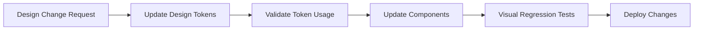

# DESIGN SYSTEM GOVERNANCE CONSTITUTION

## 🎯 MISSION
Establish permanent design system governance to prevent future inconsistencies and ensure 100% design token adoption across the RSVP platform.

## 📋 MANDATORY DEVELOPMENT RULES

### 1. ZERO TOLERANCE FOR HARDCODED VALUES
- ❌ **PROHIBITED**: Hardcoded colors, spacing, shadows, typography, or any design values
- ❌ **PROHIBITED**: Inline styles without design token equivalents  
- ❌ **PROHIBITED**: Custom CSS properties that duplicate shadcn/ui variables
- ❌ **PROHIBITED**: Arbitrary Tailwind values like `bg-[#7A51E1]` or `rounded-[8px]`
- ✅ **REQUIRED**: Use shadcn/ui CSS variables: `hsl(var(--primary))`, `hsl(var(--foreground))`
- ✅ **REQUIRED**: Use semantic Tailwind classes: `bg-primary`, `text-foreground`, `rounded-md`
- ✅ **REQUIRED**: Reference `client/src/design-system/tokens.ts` for extended system tokens

### 2. SHADCN/UI + DESIGN TOKEN ENFORCEMENT
```typescript
// ❌ NEVER DO THIS - Hardcoded values
const Button = styled.button`
  color: /* #7A51E1 */;           // Hardcoded color - PROHIBITED
  padding: /* 16px 24px */;       // Hardcoded spacing - PROHIBITED
  border-radius: /* 8px */;       // Hardcoded radius - PROHIBITED
  box-shadow: /* 0 4px 6px rgba(0,0,0,0.07) */; // Hardcoded shadow - PROHIBITED
`;

// ❌ NEVER DO THIS - Arbitrary Tailwind values
// <button className="bg-[hardcoded] text-[hardcoded] rounded-[hardcoded]">
//   Bad Button - DO NOT USE ARBITRARY VALUES
// </button>

// ✅ ALWAYS DO THIS - Shadcn/ui CSS variables
const Button = styled.button`
  color: hsl(var(--primary-foreground));
  background: hsl(var(--primary));
  border-radius: calc(var(--radius) - 2px);
  padding: 1rem 1.5rem;
`;

// ✅ ALWAYS DO THIS - Semantic Tailwind classes
<button className="bg-primary text-primary-foreground rounded-md px-4 py-2">
  Good Button
</button>

// ✅ ALWAYS DO THIS - Extended design tokens for complex scenarios
import { designSystem } from '@/design-system/tokens';
const CustomComponent = styled.div`
  color: hsl(var(--primary));                    // Shadcn/ui for standard colors
  box-shadow: ${designSystem.shadows.light.md}; // Extended tokens for shadows
  z-index: ${designSystem.zIndex.modal};         // Extended tokens for z-index
`;
```

### 3. COMPONENT DEVELOPMENT STANDARDS
- **New Components**: Must be built with design tokens exclusively
- **Component Variants**: Must be token-based configurations
- **Style Overrides**: Must extend or compose tokens, never replace
- **Responsive Design**: Must use breakpoint tokens from design system

### 4. DESIGN CHANGE PROTOCOL


## 🛡️ ENFORCEMENT MECHANISMS

### 1. ESLint Rules (Automated)
```javascript
// .eslintrc.js additions
module.exports = {
  rules: {
    // Detect hardcoded colors
    'no-hardcoded-colors': 'error',
    // Detect hardcoded spacing
    'no-magic-numbers': ['error', { 
      ignore: [0, 1, -1],
      ignoreArrayIndexes: true 
    }],
    // Require design token imports
    'require-design-tokens': 'error',
  }
};
```

### 2. Pre-commit Hooks
```bash
#!/bin/sh
# .git/hooks/pre-commit

echo "🔍 Checking design token compliance..."

# Check for hardcoded hex colors
if git diff --cached --name-only | xargs grep -l '#[0-9a-fA-F]\{3,6\}' | grep -E '\.(tsx?|jsx?|css|scss)$'; then
    echo "❌ Hardcoded colors detected. Use design tokens instead."
    exit 1
fi

# Check for hardcoded pixel values
if git diff --cached --name-only | xargs grep -l '[0-9]\+px' | grep -E '\.(tsx?|jsx?)$'; then
    echo "❌ Hardcoded pixel values detected. Use design tokens instead."
    exit 1
fi

# Check for design token imports in styled components
if git diff --cached --name-only | xargs grep -l 'styled\.' | xargs grep -L 'design-system/tokens'; then
    echo "❌ Styled components must import design tokens."
    exit 1
fi

echo "✅ Design token compliance verified"
```

### 3. Component Review Checklist
Before merging any component changes, verify:

- [ ] ✅ Uses design tokens for all colors
- [ ] ✅ Uses design tokens for all spacing
- [ ] ✅ Uses design tokens for typography
- [ ] ✅ Uses design tokens for shadows/borders
- [ ] ✅ Uses design tokens for animations/transitions
- [ ] ✅ Responsive using breakpoint tokens
- [ ] ✅ States use componentStates tokens
- [ ] ✅ Focus states use focusStates tokens
- [ ] ✅ No hardcoded values anywhere
- [ ] ✅ Follows design system patterns

### 4. Automated Design Token Coverage Reporting
```typescript
// scripts/design-token-coverage.ts
import { glob } from 'glob';
import fs from 'fs';

async function analyzeTokenCoverage() {
  const files = await glob('client/src/**/*.{ts,tsx,js,jsx}');
  let totalLines = 0;
  let tokenizedLines = 0;
  let hardcodedValues: string[] = [];
  
  for (const file of files) {
    const content = fs.readFileSync(file, 'utf8');
    const lines = content.split('\n');
    totalLines += lines.length;
    
    // Check for design token imports
    const hasTokenImport = content.includes('design-system/tokens');
    
    // Detect hardcoded values
    const hexColors = content.match(/#[0-9a-fA-F]{3,6}/g);
    const pixelValues = content.match(/\d+px/g);
    
    if (hexColors || pixelValues) {
      hardcodedValues.push(`${file}: ${[...hexColors || [], ...pixelValues || []].join(', ')}`);
    }
    
    if (hasTokenImport) {
      tokenizedLines += lines.length;
    }
  }
  
  const coverage = Math.round((tokenizedLines / totalLines) * 100);
  
  console.log(`🎯 Design Token Coverage: ${coverage}%`);
  console.log(`📊 Total files analyzed: ${files.length}`);
  console.log(`❌ Hardcoded values found: ${hardcodedValues.length}`);
  
  if (hardcodedValues.length > 0) {
    console.log('\n🚨 HARDCODED VALUES TO FIX:');
    hardcodedValues.forEach(issue => console.log(`  - ${issue}`));
    process.exit(1);
  }
  
  if (coverage < 95) {
    console.log(`⚠️ Warning: Coverage below target (95%). Current: ${coverage}%`);
    process.exit(1);
  }
  
  console.log('✅ Design token coverage meets standards!');
}

analyzeTokenCoverage();
```

## 🎨 FUTURE DEVELOPMENT STANDARDS

### 1. New Component Protocol
```typescript
// Template for new components
import { designSystem } from '@/design-system/tokens';
import { ComponentProps } from '@/types';

interface NewComponentProps extends ComponentProps {
  variant?: 'primary' | 'secondary' | 'ghost';
  size?: 'sm' | 'md' | 'lg';
}

export const NewComponent = ({ variant = 'primary', size = 'md', ...props }: NewComponentProps) => {
  return (
    <StyledComponent
      $variant={variant}
      $size={size}
      {...props}
    />
  );
};

const StyledComponent = styled.div<{ $variant: string; $size: string }>`
  /* Always use design tokens */
  color: ${({ $variant }) => designSystem.componentStates.button[$variant].default.text};
  background: ${({ $variant }) => designSystem.componentStates.button[$variant].default.bg};
  padding: ${({ $size }) => designSystem.components.button.padding[$size]};
  border-radius: ${designSystem.components.button.borderRadius};
  font-weight: ${designSystem.components.button.fontWeight};
  
  /* Hover states from tokens */
  &:hover {
    background: ${({ $variant }) => designSystem.componentStates.button[$variant].hover.bg};
    transform: ${designSystem.animations.hover.scale};
    transition: all ${designSystem.animations.duration.hover} ${designSystem.animations.easing.standard};
  }
  
  /* Focus states from tokens */
  &:focus {
    outline: ${designSystem.focusStates.focusRing.width} ${designSystem.focusStates.focusRing.style} ${designSystem.focusStates.focusRing.color};
    outline-offset: ${designSystem.focusStates.focusRing.offset};
    box-shadow: ${designSystem.focusStates.focusRing.shadow};
  }
`;
```

### 2. Design Token Extension Protocol
When new design needs arise:

1. **Assess Token Gap**: Identify what tokens are missing
2. **Update tokens.ts**: Add new tokens following existing patterns
3. **Update componentStates**: Add states for new component types
4. **Update Utility Functions**: Enhance `getColor()` and CSS generators
5. **Validate Coverage**: Ensure 100% token usage in new components
6. **Document Changes**: Update this governance document

### 3. Breaking Change Management
```typescript
// Migration guide template for token changes
export const DESIGN_TOKEN_MIGRATION_v2 = {
  // Deprecated tokens (warn but don't break)
  deprecated: {
    'colors.neutral.light.background': 'Use colors.background.light instead',
    'spacing.7': 'Use extendedSpacing.micro[7] instead',
  },
  
  // Breaking changes (require immediate action)
  breaking: {
    'components.button.sizes': 'Renamed to components.button.height',
  }
};
```

## ⚡ QUALITY GATES

### 1. Design Token Coverage Metrics
- **Target Coverage**: ≥95% design token adoption
- **Measurement**: Automated analysis of all component files
- **Frequency**: Every commit via pre-commit hooks
- **Enforcement**: Block deployments below threshold

### 2. Visual Regression Testing
```typescript
// playwright.config.ts - Visual regression setup
export default defineConfig({
  projects: [
    {
      name: 'visual-regression',
      use: { ...devices['Desktop Chrome'] },
      testMatch: '**/visual-regression.spec.ts',
    }
  ],
  expect: {
    // Strict visual comparison
    threshold: 0.2,
    // Compare against design token implementation
    toHaveScreenshot: { threshold: 0.2, maxDiffPixels: 1000 }
  }
});
```

### 3. Cross-Browser Consistency Validation
- **Chrome**: Primary development browser
- **Safari**: iOS/macOS compatibility  
- **Firefox**: Alternative engine validation
- **Edge**: Enterprise environment support
- **Mobile**: iOS Safari, Chrome Mobile

### 4. Performance Monitoring
```typescript
// Design system performance tracking
const DESIGN_SYSTEM_METRICS = {
  tokenBundleSize: '<50KB', // Design tokens bundle
  componentRenderTime: '<16ms', // 60fps target
  cssCustomProperties: '<500', // Limit CSS vars
  themeSwitch: '<200ms', // Dark/light mode toggle
};
```

## 🔧 ENFORCEMENT AUTOMATION

### 1. GitHub Actions Workflow
```yaml
# .github/workflows/design-system-compliance.yml
name: Design System Compliance
on: [push, pull_request]

jobs:
  design-compliance:
    runs-on: ubuntu-latest
    steps:
      - uses: actions/checkout@v3
      - name: Setup Node.js
        uses: actions/setup-node@v3
        with:
          node-version: '18'
      
      - name: Install dependencies
        run: npm ci
      
      - name: Check design token coverage
        run: npm run check:design-tokens
        
      - name: Run ESLint design rules
        run: npm run lint:design-system
        
      - name: Visual regression tests
        run: npm run test:visual
        
      - name: Generate coverage report
        run: npm run report:design-coverage
```

### 2. IDE Integration
```json
// .vscode/settings.json
{
  "eslint.rules.customizations": [
    { "rule": "no-hardcoded-colors", "severity": "error" },
    { "rule": "require-design-tokens", "severity": "error" }
  ],
  "editor.codeActionsOnSave": {
    "source.fixAll.design-tokens": true
  }
}
```

### 3. Package.json Scripts
```json
{
  "scripts": {
    "check:design-tokens": "tsx scripts/design-token-coverage.ts",
    "lint:design-system": "eslint --ext .ts,.tsx --config .eslintrc.design.js client/src",
    "test:visual": "playwright test visual-regression.spec.ts",
    "report:design-coverage": "tsx scripts/generate-coverage-report.ts",
    "validate:design-system": "npm run check:design-tokens && npm run lint:design-system && npm run test:visual"
  }
}
```

## 📊 MONITORING & METRICS

### 1. Design System Health Dashboard
Track these metrics continuously:
- Design token coverage percentage
- Number of hardcoded values detected
- Visual regression test pass rate
- Component consistency score
- Performance impact of design system
- Developer adoption rate

### 2. Quarterly Design System Reviews
- **Coverage Analysis**: Review token usage across all components
- **Performance Audit**: Ensure design system doesn't impact performance
- **Developer Experience**: Gather feedback on token usability
- **Visual Consistency**: Cross-platform visual validation
- **Technical Debt**: Identify and plan resolution for design debt

## 🚨 VIOLATION RESPONSE PROTOCOL

### Immediate Actions (Automated)
1. **Pre-commit**: Block commits with hardcoded values
2. **CI/CD**: Fail builds with design token violations
3. **PR Reviews**: Auto-request changes for non-compliant code
4. **Alerts**: Notify design system team of violations

### Remediation Process
1. **Identify**: Automated detection reports violations
2. **Assess**: Evaluate impact and urgency of fix
3. **Fix**: Update code to use appropriate design tokens
4. **Validate**: Ensure fix doesn't break existing functionality
5. **Deploy**: Release fix with proper change communication

## 📈 SUCCESS METRICS

### Target Achievements
- **100% Design Token Coverage**: All design values use tokens
- **0 Hardcoded Values**: No hardcoded colors, spacing, typography
- **95% Visual Consistency**: Cross-browser, cross-device consistency
- **<200ms Theme Switch**: Fast dark/light mode transitions
- **100% Component Compliance**: All components follow token patterns

### Long-term Goals
- **Self-Healing Design System**: Automatic fixes for common violations
- **AI-Powered Token Suggestions**: Intelligent token recommendations
- **Real-time Design Sync**: Figma-to-tokens automatic synchronization
- **Cross-Platform Consistency**: Web, mobile, email template alignment

---

## 📝 DOCUMENT MAINTENANCE

**Last Updated**: Current Implementation  
**Next Review**: Post Phase C completion  
**Maintained By**: Design System Team  
**Version**: 1.0 - Foundation  

This governance document is living and will evolve with the design system. All changes must be reviewed and approved by the design system team.